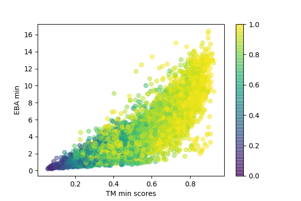

# PISCES analysis

This folder contains the scripts and the data necessary to reproduce the results described in the paragraph 'EBA captures structural similarity in the twilight zone' of: [https://doi.org/10.1101/2022.12.13.520313](https://doi.org/10.1101/2022.12.13.520313).

### Additional modules
Install the following modules in order to run the notebook: 'EBA_pisces.ipynb'.
```
pip install scipy
pip install matplotlib
```

### Compute embeddings
The first step of the analysis consists in computing the per-residue embeddings using the desired language model (ProtT5 or ESMb1). The necessary script can be found in [/scripts](https://git.scicore.unibas.ch/schwede/EBA/-/tree/main/analysis/pisces/scripts). The embeddings will be stored in [/data/embeddings](https://git.scicore.unibas.ch/schwede/EBA/-/tree/main/analysis/pisces/data/embeddings). The computational times of this process strongly benefits from the usage of a GPU.

```
python save_embeddings.py ProtT5
python save_embeddings.py ESMb1

```

### Compute EBA/AD scores
It is then possible to compute the EBA and AD scores. The necessary scripts can be found in [/scripts](https://git.scicore.unibas.ch/schwede/EBA/-/tree/main/analysis/pisces/scripts). The resulting scores will be stored in [/results](https://git.scicore.unibas.ch/schwede/EBA/-/tree/main/analysis/pisces/results).
```
python compute_EBA_pisces_pairs.py ProtT5
python compute_EBA_pisces_pairs.py ESMb1

python compute_AD_pisces_pairs.py ProtT5
python compute_AD_pisces_pairs.py ESMb1

```


### Spearman correlation
The comparison of the predicted similarity scores and the TM scores of the PISCES pairs can be performed with the notebook: 'EBA_pisces.ipynb'.




### Benchmark against TM-vec and pLM-BLAST
The code to run the TM-vec and pLM-BLAST on the same data can be found in [/scripts](https://git.scicore.unibas.ch/schwede/EBA/-/tree/main/analysis/pisces/scripts) as well.
However, in order to run it, bot TM-vec and pLM-BLAST need to be installed. Follow: 
* TM-vec [https://github.com/tymor22/tm-vec](https://github.com/tymor22/tm-vec) 
* pLM-BLAST [https://github.com/labstructbioinf/pLM-BLAST](https://github.com/labstructbioinf/pLM-BLAST)
